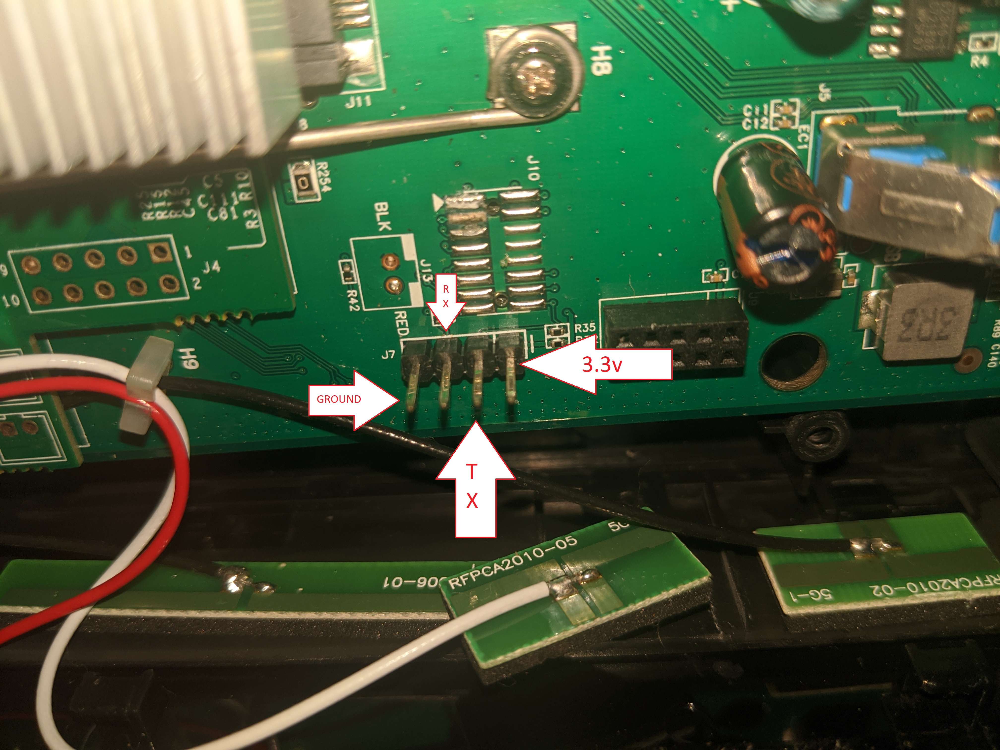

# Aztech FG7009GR(AC)
## General Information
CPU: BCM63139  
NAND: Spansion S34ML01G (131072KB)  
RAM: 256MB  
This is a SingTel specific SKU. The generic version is known as the Aztech FG7008GR(AC)

## Board Photo

## UART Information

Look for the jumper headers labeled J7.  
Starting from the pin closest to the J7 label and moving right  
1. Ground
2. Rx
3. Tx
4. 3.3v

The serial connenection has a baud rate of 115200bps.  
A login is required to access the serial console.
